# ProofPilot — Intent Firewall for Autonomous Onchain Agents

> **The agent proposes an action. ProofPilot verifies that the proposal is exactly authorized.
> KeeperHub executes it. Independent verification confirms the resulting effect.**

ProofPilot is a **multi-protocol semantic authorization prototype** between an AI agent and onchain execution. A real
LLM proposes an action, ProofPilot checks that proposal against a typed user mandate, KeeperHub's
official hosted MCP simulates and executes approved actions, and an independent read layer verifies
the receipt and resulting chain state before ProofPilot can report `VERIFIED` with verification
level `L2_EXECUTION_EFFECT_VERIFIED`.

**Core insight: `Executable != Authorized`.** A transaction can be ABI-valid, simulation-valid and
fully executable while still violating the user's explicit machine-checkable mandate.

```text
User mandate -> Bounded AI agent -> ProofPilot -> KeeperHub -> Blockchain -> Independent verification
```

## At a glance

| Signal | Current evidence |
| --- | --- |
| Real Aave evidence | Hardened [`0 -> 1`](https://sepolia.basescan.org/tx/0xdb0bc80711a6aa167038f990471ff59895f2661a1067df11ab46a48518946f90) + [`1 -> 0` cleanup](https://sepolia.basescan.org/tx/0x2f42aefeed93e25df81b90a4e56b08698ffaf407f0f8ae7a6c970157a3a64780); current E-Mode `0` |
| KeeperHub integration | Official hosted MCP, live tool discovery, simulation, execution and status |
| Working build | One-command reviewer path: `python scripts/run_competition_demo.py` |
| Reliability | **155 tests**, 15/15 reliability cases, 0 unsafe broadcasts in the reliability matrix |
| Final frozen benchmark | 50 scheduled, 40 semantic attacks, 29 KeeperHub simulation-valid; **0/29 observed unsafe approvals** |
| User controls | Observe / Confirm / Autonomous + human-readable Intent Preview |
| Auditability | Self-verifying `proofpilot.execution-trace.v2` + offline proof viewer |

> ProofPilot is **not** another critic LLM and **not** another KeeperHub wrapper. The LLM can propose;
> the typed mandate authorizes; KeeperHub remains the sole transaction write path.

## The problem: executable does not mean authorized

Suppose the user says:

> Set my Aave E-Mode category exactly to `1`. Do not change collateral settings. Attach no native ETH.

The agent might correctly propose `setUserEMode(1)`, or it might propose `setUserEMode(0)`. The
second call can still be a valid, non-reverting transaction. Simulation can answer whether it will
execute; it cannot determine whether category `0` is what the user authorized.

ProofPilot adds that missing semantic boundary.

```mermaid
flowchart LR
    U["User mandate"] --> D["ProofPilot Doctor\nRuntime readiness"]
    D --> A["AI Agent\nProposes action"]
    A --> P["Intent Preview\nHuman-readable diff"]
    P --> I["ProofPilot\nTyped Intent IR + deterministic assurance"]

    I -- "mismatch" --> B["BLOCKED\nNo broadcast"]
    I -- "authorized" --> Q["Canonical execution payload\nSHA-256 commitment"]
    Q --> S["KeeperHub Official MCP\nSimulation + sender/target/value binding"]

    S --> M{"Execution mode"}
    M -- "Observe" --> O["SIMULATED\nNo broadcast"]
    M -- "Confirm" --> H["Human approval"]
    H -- "reject / absent" --> O
    H -- "approve" --> F["Pre-broadcast freshness\n+ payload commitment match"]
    M -- "Autonomous" --> F
    F --> E["KeeperHub Execute + Status"]

    E --> C["Base Sepolia\nAave V3 / ERC-20"]
    C --> V["Independent Verification\nReceipt + post-state + execution binding"]
    V --> X["L2_EXECUTION_EFFECT_VERIFIED"]

    R["Independent Base RPC\nREAD ONLY"] -. "pre-state / freshness" .-> I
    R -. "receipt + post-state" .-> V
```



Full architecture and responsibility split: [`docs/ARCHITECTURE.md`](docs/ARCHITECTURE.md).

## 60-second reviewer path

All canonical demos are **Base Sepolia testnet only**. Configure a valid organization-scoped
`KH_API_KEY`; Agent modes also require the configured NVIDIA proposal-model credential.

### Safe default — one command, zero writes

```bash
python scripts/run_competition_demo.py
```

This streams the full safe path:

```text
Doctor READY
  → real LLM proposal
  → Intent Preview
  → deterministic ProofPilot authorization
  → KeeperHub simulation
  → SIMULATED
  → broadcast=false
```

Preserved successful evidence is separated by role: the
[`bounded LLM proposal + simulation`](artifacts/demo/proofpilot-agent-simulation-20260809.json) and
the [`hardened Observe preview`](artifacts/demo/proofpilot-five-fixes-observe.json).

In the final closeout validation, Doctor reported `READY`, then the external provider returned a
proposal that failed ABI binding. The runtime stopped before KeeperHub simulation with
`broadcast=false`; no sample was retried to hide the provider failure.

### Explicit live Base Sepolia path

```bash
python scripts/run_competition_demo.py --live
```

`--live` selects Autonomous mode. A write is permitted only after deterministic Intent Assurance,
KeeperHub simulation and the pre-broadcast freshness check all pass.

### Wrong-but-executable contrast case

```bash
python scripts/demo_proofpilot.py --attack
```

The attack path is observe-only by construction. KeeperHub can confirm the wrong action is
executable while ProofPilot blocks it before broadcast.

<details>
<summary><strong>Additional reviewer commands</strong></summary>

```bash
# Full read-only readiness check
python scripts/proofpilot_doctor.py --probe-agent

# Direct KeeperHub hosted-MCP connectivity / discovery check
python scripts/keeperhub_mcp_check.py

# Individual execution-control modes
python scripts/demo_proofpilot.py --agent --mode observe
python scripts/demo_proofpilot.py --agent --mode confirm
python scripts/demo_proofpilot.py --agent --mode autonomous

# Offline proof rendering of the hardened execution
python scripts/show_proof.py artifacts/demo/proofpilot-five-fixes-live.json
```

</details>

## What the Doctor checks

`proofpilot_doctor.py` is read-only. Its report records the KeeperHub discovery tools it actually
invoked and explicitly reports that simulation/execution were not invoked. It verifies the runtime
before the Agent gets an execution path:

- KeeperHub official hosted MCP connectivity;
- live MCP tool inventory (**35 tools** in the latest recorded run);
- Base Sepolia `84532` present as a **stable** chain in live action schemas;
- live Aave V3 protocol discovery (**7 actions** in the latest recorded run; informational only —
  the Base Sepolia E-Mode demo uses generic `execute_contract_call`);
- wallet integration and native testnet gas;
- independent Base Sepolia read layer;
- Aave Pool code and current E-Mode state;
- optional proposal-only LLM probe.

Recorded Doctor evidence:
[`artifacts/runtime/competition-demo-doctor.json`](artifacts/runtime/competition-demo-doctor.json) → `READY`, zero writes.

## Intent Preview and execution controls

Every safe proposal gets a human-readable preview before the execution-control gate. For the Aave
demo it shows the exact E-Mode before/after value, network, native ETH value, token-transfer effect
and collateral-setting effect.

| Mode | What happens | Broadcast? |
| --- | --- | ---: |
| **Observe** | Agent proposal → Preview → ProofPilot → KeeperHub simulation | **Never** |
| **Confirm** | Same path, then explicit human approval | Only after approval |
| **Autonomous** | Same path, then freshness gate and guarded execution | Only after all gates pass |

Preview and execution-control decisions are stored in `proofpilot.execution-trace.v2`, so the
offline proof answers both **what happened** and **why it was allowed**.

## Why KeeperHub

ProofPilot deliberately does not reimplement transaction infrastructure. KeeperHub remains the
execution/reliability layer and the only write path.

- KeeperHub MCP reference: <https://docs.keeperhub.com/ai-tools/mcp-server>
- KeeperHub Hackathon Quickstart: <https://docs.keeperhub.com/quickstart>
- Direct execution and simulation semantics: <https://docs.keeperhub.com/api/direct-execution>

Runtime flow:

```text
AI Agent     → what action should I propose?
ProofPilot   → is that exact action authorized?
KeeperHub    → can the authorized action execute reliably?
Blockchain   → what actually happened?
ProofPilot   → did the declared outcome actually occur?
```

The independent Base RPC is **read-only** and has no key, signing or broadcast surface.

## Real Base Sepolia execution evidence

The project preserves multiple real testnet executions. The most important competition evidence is
the real LLM-Agent path:

| Run | Result | BaseScan |
| --- | --- | --- |
| **LLM Agent → Aave `0 → 1`** | `L2_EXECUTION_EFFECT_VERIFIED`: live MCP discovery → LLM proposal → ProofPilot PASS → KeeperHub execution → independent post-state | [tx](https://sepolia.basescan.org/tx/0x59b215cd9148228b6f97b587a1197a563c55150fa2739f4758c12fe921c43683) |
| Journal-hardened Aave `0 → 1` | `L2_EXECUTION_EFFECT_VERIFIED`: durable idempotency journal + strict simulation + execution binding | [tx](https://sepolia.basescan.org/tx/0xdb0bc80711a6aa167038f990471ff59895f2661a1067df11ab46a48518946f90) |
| Journal-hardened cleanup `1 → 0` | `L2_EXECUTION_EFFECT_VERIFIED` | [tx](https://sepolia.basescan.org/tx/0x2f42aefeed93e25df81b90a4e56b08698ffaf407f0f8ae7a6c970157a3a64780) |
| Autonomous usability demo `0 → 1` | `L2_EXECUTION_EFFECT_VERIFIED` | [tx](https://sepolia.basescan.org/tx/0x15aa2552b8acd5cc63c66cc243078b5ff4b8b8a22567af1c8bc0b705642c16cf) |
| Autonomous cleanup `1 → 0` | `L2_EXECUTION_EFFECT_VERIFIED` | [tx](https://sepolia.basescan.org/tx/0xf8f76909e8983385049db188e749d8af27f9318c5c568eabdb0bb2d00aab317c) |
| Earlier canonical Aave `0 → 1` | `L2_EXECUTION_EFFECT_VERIFIED` | [tx](https://sepolia.basescan.org/tx/0x4c79d1b9237da236b3b927793923f0820470291b12eac66377f496582c33aebb) |

Earlier preserved evidence also includes a real Base Sepolia ERC-20 transfer with exact
sender/recipient balance-delta verification.

## Wrong-but-executable example

```text
User intent:        setUserEMode(1)
Wrong proposal:     setUserEMode(0)

KeeperHub simulation:
  success=true
  wouldRevert=false

ProofPilot:
  BLOCKED
  semantic deviation=wrong_emode_category

Broadcast attempted:
  false
```

This is the distinction at the center of the project: **execution validity and semantic
authorization are different properties**.

## Reliability and auditability

Every canonical run can produce an integrity-checked, self-verifying
`proofpilot.execution-trace.v2` containing:

- original user intent, source hash and typed Intent IR;
- Agent proposal and proposal hash;
- human-readable Intent Preview;
- every deterministic authorization check;
- pre-state, freshness and KeeperHub simulation evidence;
- Observe / Confirm / Autonomous control decision;
- KeeperHub execution ID, status and transaction hash when a write occurs;
- independent receipt and post-state verification;
- one explicit final state such as `SIMULATED`, `BLOCKED`, `VERIFIED` or a failure state.

`VERIFIED` cannot be emitted unless KeeperHub terminal evidence, the independent receipt,
execution/effect binding and the declared postcondition all pass. For Aave the evidence level is
`L2_EXECUTION_EFFECT_VERIFIED`, not full internal-call proof or L1 finality.

Machine-readable reliability report:
[`artifacts/reliability/reliability-report.json`](artifacts/reliability/reliability-report.json)
→ **15/15 passed, 0 failed, 0 unsafe broadcasts**.

## Adversarial evidence

Benchmarks are **evidence for the authorization boundary**, not the product itself.

| Evaluation | Result |
| --- | ---: |
| Blind KeeperBench | **0 / 700 unsafe approvals** |
| KeeperBench 2.1 | **100 trials / 1000 generated cases** |
| ERC-20 External Red-Team | **0 / 21** unsafe approvals on KeeperHub simulation-valid semantic attacks |
| Aave V3 External Red-Team | **0 / 29** observed unsafe approvals on KeeperHub simulation-valid semantic attacks |

### Frozen Aave closeout

The strongest live semantic benchmark uses the same declared Aave intent as the demo and two
external NVIDIA-hosted attacker models.

| Outcome | Result |
| --- | ---: |
| Scheduled attempts | 50 |
| Provider success / parse-valid | **48 / 50** |
| ABI-bound | **47 / 50** |
| Independently labeled semantic attacks | **40** |
| KeeperHub simulation-valid semantic attacks | **29** |
| **ProofPilot unsafe approvals** | **0 / 29 observed** |
| Aave protocol-ABI allowlist unsafe approvals | **29 / 29** |

The 29 denominator cases all satisfied KeeperHub's live simulation criterion
`success=true && wouldRevert=false`. Two provider failures, three non-ABI-bound rows and eleven
simulation-invalid semantic attacks remain in the 50 scheduled rows; none was replaced. No
red-team proposal was broadcast.

- Report: [`docs/EXTERNAL_REDTEAM_AAVE.md`](docs/EXTERNAL_REDTEAM_AAVE.md)
- Final-submission frozen artifact: [`artifacts/keeperbench/external-redteam-aave-formal-20260809-25x2-final-submission.json`](artifacts/keeperbench/external-redteam-aave-formal-20260809-25x2-final-submission.json)
- Artifact SHA-256: `c88901d6867fbe82a5d0facf776273e879408f31d08ae562830c3f84bd7146ef`
- Defender SHA-256: `68fda657312fa1729ad178d2ef01d6ed5ab72451b72067338f3875ff6145527e`
- Harness SHA-256: `d742351cab579a547077c79ca5aa3a5a842ae9ae9c43dd5bd55dd59f3ee2d436`

> `0 / 29` is an **observed benchmark result**, not a claim of universal security.

## Security boundary

- Testnet-only competition build; default chain is Base Sepolia.
- The proposal LLM receives no KeeperHub API key and no wallet key.
- The LLM has no direct KeeperHub write-tool handle; it returns only a candidate action.
- ABI binding canonicalizes model output but does not broaden target/function/argument authority.
- The exact canonical KeeperHub contract-call payload is committed before simulation; the
  pre-broadcast payload must reproduce the same commitment.
- KeeperHub simulation evidence is bound to the authorized sender, target and native value.
- Aave `VERIFIED` additionally binds the execution envelope to the expected account/Pool and the
  resulting `UserEModeSet(user, categoryId)` event; this is an effect/identity binding, not a full
  EVM call-trace proof.
- Malformed output, abstention, unsupported tools, semantic mismatch, stale state or failed
  simulation all fail closed.
- Attack mode cannot be combined with a broadcast-capable mode.
- KeeperHub is the sole write path; independent RPC is read-only.
- Secrets are excluded from serialized traces and artifacts.

## Repository map

```text
proofpilot-keeperhub/
├── src/proofpilot/                  # intent, policy, KeeperHub, verification and proof core
├── scripts/
│   ├── run_competition_demo.py      # one-command reviewer entry point
│   ├── demo_proofpilot.py           # Agent / Observe / Confirm / Autonomous runtime
│   ├── proofpilot_doctor.py         # read-only runtime readiness check
│   ├── show_proof.py                # offline ExecutionTrace renderer
│   ├── run_external_redteam.py      # frozen ERC-20 external red-team runner
│   └── run_external_redteam_aave.py # frozen Aave external red-team runner
├── tests/                           # 155 tests at current competition closeout
├── artifacts/                       # preserved runtime, proof and benchmark evidence
├── contracts/                       # isolated test contracts
└── docs/                            # architecture, demo, benchmark and submission material
```

## Reproduce locally

```bash
python -m unittest discover -s tests -p 'test_*.py'
python -m compileall src scripts tests
```

The current competition closeout is **155 tests PASS** and `compileall` PASS.

## Scope and limitations

This is a bounded hackathon implementation, not a claim of universal DeFi security.

- The strongest live semantic evidence currently covers ERC-20 transfer and Aave V3 E-Mode.
- The natural-language mandate compiler is a bounded reference compiler.
- The Aave red-team denominator is dominated by 28 wrong-category attacks, with one simulation-valid
  wrong-function/arguments case.
- Multi-step trajectory assurance, persistent permission profiles and Safe-specific sender
  semantics remain future work.
- The competition runtime intentionally stays on testnet.

## Submission package

- **DoraHacks copy:** [`docs/DORAHACKS_SUBMISSION.md`](docs/DORAHACKS_SUBMISSION.md)
- **2–3 minute video script:** [`docs/FINAL_VIDEO_SCRIPT.md`](docs/FINAL_VIDEO_SCRIPT.md)
- **Recording safety checklist:** [`docs/VIDEO_RECORDING_CHECKLIST.md`](docs/VIDEO_RECORDING_CHECKLIST.md)
- **Architecture:** [`docs/ARCHITECTURE.md`](docs/ARCHITECTURE.md)
- **One-command demo:** [`docs/COMPETITION_DEMO.md`](docs/COMPETITION_DEMO.md)
- **AI Agent boundary:** [`docs/AI_AGENT_RUNTIME.md`](docs/AI_AGENT_RUNTIME.md)
- **Judge brief:** [`docs/JUDGE_BRIEF.md`](docs/JUDGE_BRIEF.md)
- **Final must-fix audit:** [`docs/FINAL_SUBMISSION_AUDIT.md`](docs/FINAL_SUBMISSION_AUDIT.md)

## Final pitch

AI agents should be able to decide autonomously without receiving unlimited execution authority.

**The agent proposes an action for a bounded user mandate. ProofPilot determines whether that
proposal is authorized. KeeperHub executes the authorized action.**
