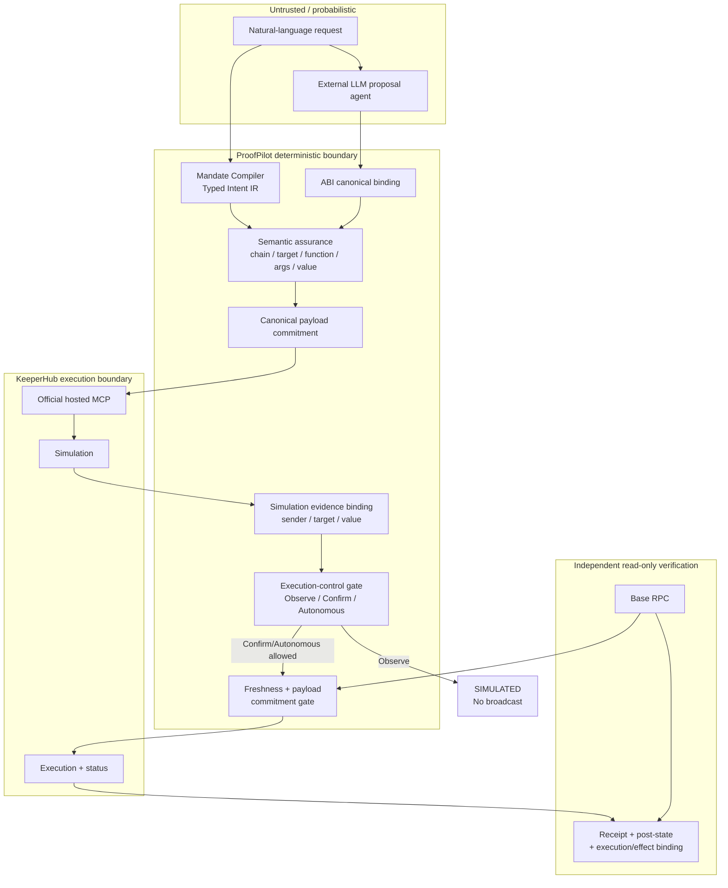

# ProofPilot Competition Architecture

> **Runtime principle:** the Agent may propose an action, but only the typed user mandate can
> authorize it. KeeperHub remains the transaction execution layer.

## Core architecture

```mermaid
flowchart LR
    U["User Mandate\nNatural language"] --> D["ProofPilot Doctor\nRuntime readiness"]
    D --> A["AI Agent\nLLM proposes action"]
    A --> P["Intent Preview\nHuman-readable diff"]
    P --> I["ProofPilot Intent Assurance\nTyped Intent IR\nDelegation + provenance\nDeterministic checks"]

    I -- "mismatch" --> B["BLOCKED\nNo broadcast"]
    I -- "authorized" --> Q["Canonical execution payload\nSHA-256 commitment"]
    Q --> S["KeeperHub Official MCP\nSimulation"]
    S --> SB["Simulation binding\nsender / target / native value"]

    SB --> M{"Execution mode"}
    M -- "Observe" --> O["SIMULATED\nNo broadcast"]
    M -- "Confirm" --> H["Human approval"]
    H -- "reject / absent" --> O
    H -- "approve" --> F["Pre-broadcast freshness\n+ commitment match"]
    M -- "Autonomous" --> F
    F --> E["KeeperHub Execute\n+ status"]

    E --> C["Base Sepolia\nAave V3 / ERC-20"]
    C --> V["Independent Verification\nReceipt + post-state\n+ execution/effect binding"]
    V --> X["L2_EXECUTION_EFFECT_VERIFIED\nSelf-verifying trace"]

    R["Independent Base RPC\nREAD ONLY"] -. "pre-state / freshness / post-state" .-> I
    R -. "receipt + outcome cross-check" .-> V

    K["KeeperBench + External Red-Team\nEvaluation evidence only"] -. "tests authorization boundary" .-> I
```



## Trust boundary



### What the LLM does not receive

- no KeeperHub organization credential;
- no wallet private key or seed material;
- no direct KeeperHub write-tool handle;
- no ability to bypass or rewrite the typed mandate;
- no authority to convert a blocked proposal into an executable one.

The model returns only a candidate `ProposedAction`. Canonicalization may normalize representation
(for example a JSON-string array into a JSON array) but may not broaden target, function, argument
or value authority.

## Responsibility split

```text
AI Agent
  Reason / discover / propose

ProofPilot
  Compile mandate
  Explain exact change
  Authorize or reject proposal
  Commit to the exact simulation/execution payload
  Bind KeeperHub simulation evidence to sender / target / value
  Enforce Observe / Confirm / Autonomous
  Re-check pre-broadcast freshness and payload commitment
  Verify receipt, post-state and protocol-specific execution effect independently

KeeperHub
  Agent-native MCP surface
  Simulate before submit
  Execute contract call
  Return execution status / transaction evidence
  Reliability and audit infrastructure

Blockchain
  Base Sepolia L2 receipt, event and state
```

## Runtime path vs evaluation path

KeeperBench and the External LLM Red-Team are deliberately **off the production execution path**.
They test the authorization boundary but never serve as the runtime authorizer.

```text
Production:
User → AI Agent → ProofPilot deterministic authorization → KeeperHub → Chain → Verification

Evaluation:
External attacker → Independent semantic oracle → KeeperHub simulation → ProofPilot decision
```

This separation avoids defining “unsafe” as “whatever ProofPilot rejected.” Semantic attack labels
are determined independently before the defender decision in the frozen red-team protocol.

## One-sentence figure caption

> **ProofPilot sits between agent reasoning and KeeperHub execution: the bounded AI proposal agent returns an action, ProofPilot deterministically checks whether it is exactly authorized by the user's mandate, KeeperHub executes authorized actions, and ProofPilot independently verifies the resulting chain state.**

## Reviewer entry points

```bash
# Safe end-to-end path: Doctor -> Agent -> Preview -> ProofPilot -> KeeperHub simulation
python scripts/run_competition_demo.py

# Explicit Base Sepolia autonomous write path
python scripts/run_competition_demo.py --live

# Wrong-but-executable semantic contrast
python scripts/demo_proofpilot.py --attack
```

## Demo-specific flow

```text
Doctor READY
   -> User: set Aave E-Mode exactly to 1
   -> LLM: setUserEMode(1)
   -> Preview: 0 -> 1, 0 ETH, no collateral change
   -> ProofPilot: AUTHORIZED
   -> canonical payload commitment
   -> KeeperHub: simulation success / non-revert
   -> simulation sender / target / value binding
   -> Autonomous gate
   -> pre-broadcast freshness + same payload commitment
   -> KeeperHub: execute + status
   -> independent receipt + execution envelope/UserEModeSet binding + getUserEMode()
   -> L2_EXECUTION_EFFECT_VERIFIED
```

Contrast case:

```text
User mandate: setUserEMode(1)
Wrong proposal: setUserEMode(0)
KeeperHub simulation: executable
ProofPilot: BLOCKED
Broadcast: none
```

`L2_EXECUTION_EFFECT_VERIFIED` means KeeperHub terminal completion plus an independent Base
Sepolia receipt, execution/effect binding, the expected Aave `UserEModeSet` event and post-state.
It is not a proof of every internal call, full inner calldata, L1 finality or irreversible finality.
